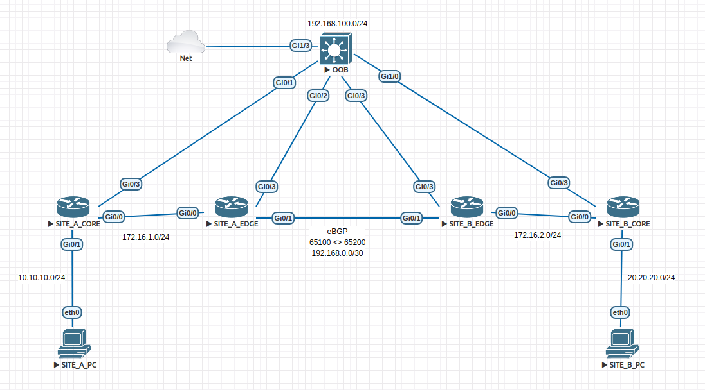

# Using Ansible with Cisco devices
This is a repositorie to store some Ansible playbooks for using with Cisco devices in the network
## Playbooks
- `backup_config.yaml` - Creates backups file in the `backup` directory of the `show running-config` command.
## Lab topology
The following topology was used to validate if script is working well

## Notes
- You can change the host list editing `hosts.ini` file.
- You can change the credentials editing `groups_vars/all.yaml` file.